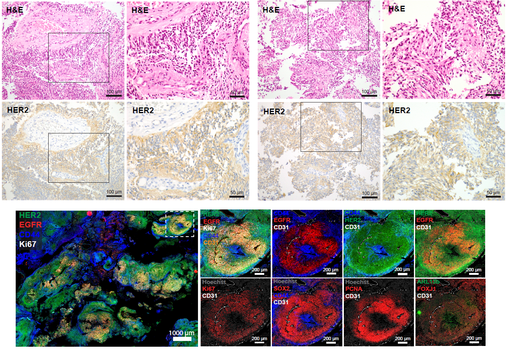

[](https://opensource.org/licenses/MIT)

# Clinical responses to trastuzumab deruxtecan in molecularly defined ependymoma

L Nicolas Gonzalez Castro*, Yi-Chien Wu*, Jia-Ren Lin, Maria-Joao Santiago-Ribeiro, Alice Laurenge, Alexandre Carpentier, Shannon Coy, Nancy U. Lin, Karima Mokhtari, Keith L. Ligon, Mehdi Touat, Sandro Santagata

\* Co-first authors



## SUMMARY

Despite evidence that antibody drug conjugates (ADCs) are active in brain metastases, their role in primary central nervous system (CNS) tumors remains unclear. We report two adults with molecularly defined ependymoma – a MYCN-amplified spinal tumor with intracranial dissemination and a supratentorial ZFTA-RELA-fused tumor with multiple recurrences – who demonstrated radiographic response and/or durable clinical and metabolic stability with trastuzumab deruxtecan (T-DXd). HER2 expression was identified by immunohistochemistry in both tumors, consistent with prior systematic profiling of ADC targets in CNS tumors. Multiplexed imaging showed broad but heterogeneous HER2 expression across tumor states in both cases; in the MYCN-amplified tumor, this occurred alongside EGFR/MAPK-enriched proliferative niches, whereas the ZFTA-RELA tumor showed more diffuse organization without strong coupling of EGFR and proliferation. These findings provide early clinical evidence supporting HER2-directed ADCs in ependymoma and highlight the value of integrated molecular and spatial profiling in interpreting therapeutic response in rare CNS tumors.

---
## IMAGE DATA RELEASE
Some data is available on-line browsing using MINERVA software (Rashid et al., 2022), which allows users to pan and zoom through the images without requiring any software installation. 

**To view the Minerva stories, please visit [tissue-atlas.org/atlas-datasets/gonzalez-castro-2026/ependymoma](https://www.cycif.org/data/gpnzalez-casatro-2026/p211-ependymoma/index.html).**  

Images (.ome.tif) in this directory accompany the data release for **Santagata-Ependymoma-2026-paper**. These files contain a subset of channels used/analyzed in the paper. The original image files and selected channel information are documented in the spreadsheet located in this directory.

NOTE: Due to Zenodo's 50 GB maximum upload size, the image pyramids are built with a 4x downsample factor between pyramid levels (compared to the original 2x). The full-resolution base layer is at 0.65 um/pixel. Images are compatible with QuPath and OMERO, but are not currently compatible with Minerva Author.

---
## ACCESS THE DATA

The dataset, consist of 3 images, is available through Zenodo at the following location: 
```text
https://doi.org/10.5281/zenodo.20212612
```

*Contact: Email tissue-atlas(at)hms.harvard.edu with the subject line "Clinical responses to trastuzumab deruxtecan in molecularly defined ependymoma" if you experience issues accessing the data or have questions.*

**Check the [Published paper](https://doi.org/MY-PAPER-DOI-URL)  here**

  
---- 
​
## File organization:   
**Each file follows the following naming convention:**    
​
Each folder corresponds to a patient sample (N).  
 
|File Type     | Description                                                                        | Location|
|--------      | ----------------------------------------------------------------------------------|---------|
|N.ome.tif     | Stitched multiplex CyCIF image pyramid in ome.tif format                           | Zenodo  |
|markers.csv   | list of all markers in ome.tif image                                               | Zenodo |
|unmicst_cellRing.csv   | single-cell feature table, including intensity data for all channels        | Zenodo |
|histoline_ROI.csv   | X and Y coordinates for histologically annotated nodule regions in the Patient 1 CyCIF image        | Zenodo |
## File List

### CyCIF WSIs

| Patient   | Folder Name | File Name         | File Size (GB) |
|------------|-------------|-------------------|----------------|
| Patient 1 | EPN01 | LSP33564.ome.tiff | 66.54 |
| Patient 2 (2018) | EPN02 | LSP68872.ome.tiff | 55.66 |
| Patient 2 (2025) | EPN02 | LSP68882.ome.tiff | 8.81 |

---

### markers.csv

| Patient or Biospecimen ID | File Name    | File Size (KB)|
|----------------------------|-------------|------------|
| LSP33564 | marker 1.csv | 10.0 |
| LSP68872 | marker 2.csv | 10.0 |
| LSP68882 | marker 3.csv | 10.0 |

---

### Nodule ROIs in Patient 1

|     File Name     | File Size (KB) |
|-------------|------------|
| LSP33564.ome.tif-histolines_1.csv | 1.0 |
| LSP33564.ome.tif-histolines_2.csv | 1.0 |
| LSP33564.ome.tif-histolines_3.csv | 1.0 |
| histoline1_cells_along_line.csv | 194.0 |
| histoline2_cells_along_line.csv | 200.0 |
| histoline3_cells_along_line | 224.0 |
